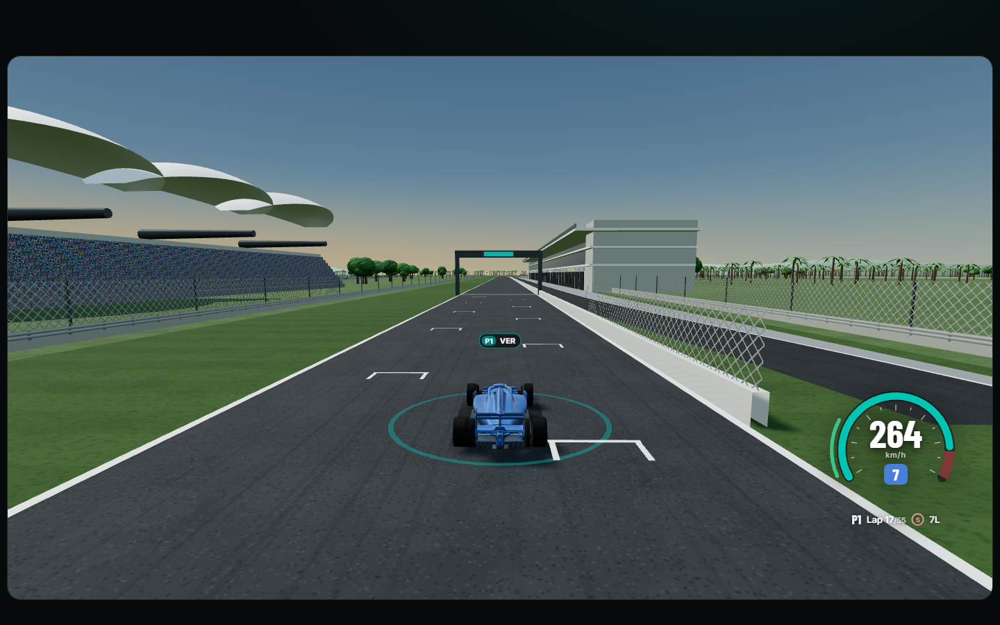
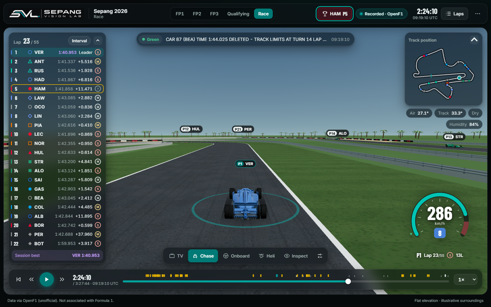
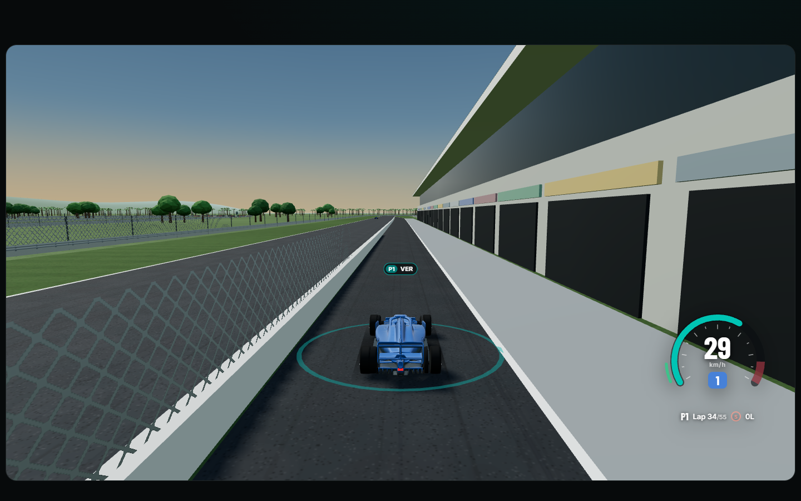
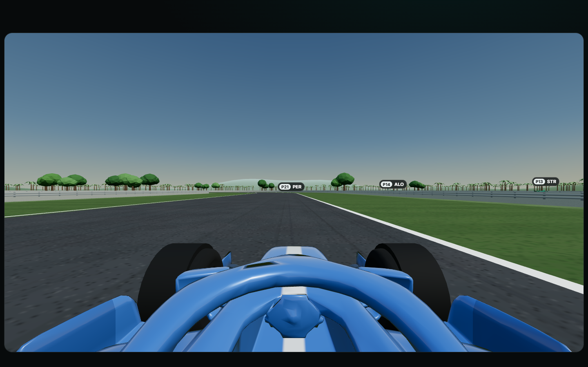
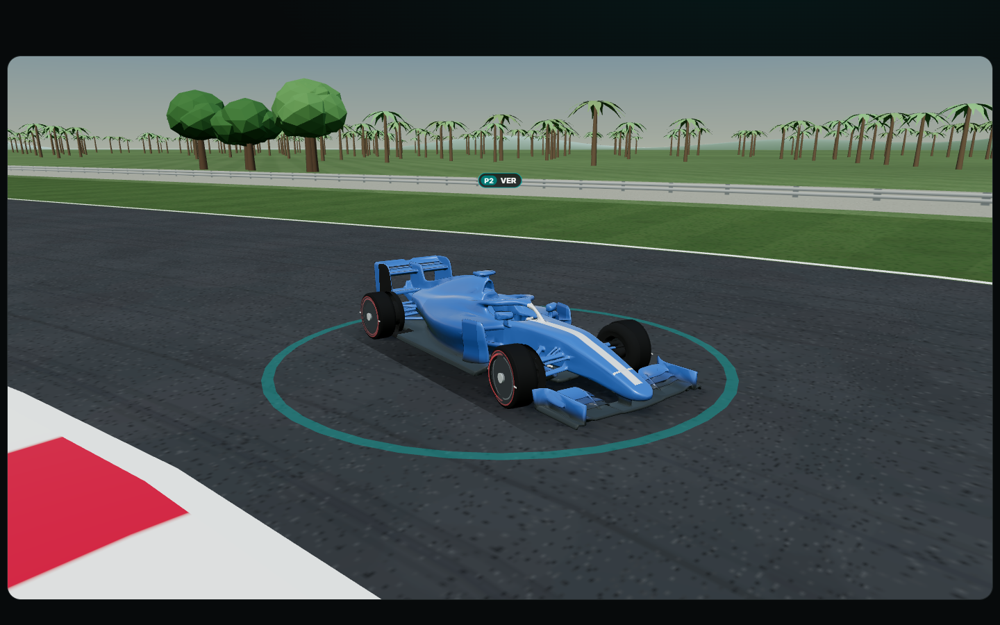

# Sepang Vision Lab

A 3D, broadcast-style replay of the 2026 Sepang weekend (OpenF1 meeting 1308, 2 to 4 October 2026): FP1, FP2, FP3, Qualifying and the Race, built from public OpenF1 data. Real driver names, team colours, positions, telemetry, tyres, race control and weather, with cars driving an aligned 3D model of the circuit.

Live: https://sepangvisionlab.madebyrazeen.com/



## Features

- **Mouse and touch camera control:** drag to orbit around the car (Onboard: look around) and drag up or down to raise or lower the camera; scroll to zoom (TV: zoom the lens); double-click to reset the view.
- **Five 3D cameras:** TV (trackside, picks a clear line of sight), Chase, Onboard, Heli and Inspect. Chase and Onboard add a speed-sensitive lens, acceleration lag and a light high-speed shake.
- **Driving HUD** in Chase and Onboard: a rev arc with shift flash, speed, gear, throttle and brake, position, lap, tyre and DRS, all from recorded channels.
- **Broadcast overlays:** a timing tower that fits all 22 cars (intervals or gap to leader, best laps, tyres, pit badges), track map, weather, race-control messages with flag status, and a replay bar with incident markers. Scrubbing keeps the replay playing if it was playing.
- **Laps panel:** lap and sector times for the selected driver, plus session details.
- **Compare two drivers** (Laps → Compare): both drivers' times on the same lap, speed against distance for each, the live time gap, and an optional ghost car showing the rival at the same moment of their own lap.
- **Shareable links:** ⋯ → "Copy link to this moment" gives a link such as `#s=race&t=9697&d=3&cam=chase` that opens that session, time, driver and camera.
- **Physics from the data:** g-forces measured from each car's recorded motion drive body lean and dive and a g-meter (friction circle) on the driver card and HUD; upshifts kick the body; brake discs glow after heavy stops (illustrative temperature model).
- **Weather:** rain falls while OpenF1 reports rain; the track then dries over about 90 minutes, with a fading sheen and spray behind cars at speed.
- **Race engineer** (headset button): ask about gaps, tyres, pace, flags, weather or your position by tapping a preset or by voice, and hear the answer as a radio call. Presets are answered from the recorded data with no key. Add your own Anthropic API key (kept only in your browser) to ask anything; Claude answers from the same data. Each answer replaces the last.
- **Cars keep their space:** cars that the aligned data would overlap are eased apart sideways; only pairs that race control reports as colliding may touch.
- **Engine sound** (off by default, ⋯ menu): synthesised from the followed car's recorded revs and throttle.
- **Guided tour:** each time the app opens, a step-by-step tour spotlights the real controls (sessions, replay bar, timing tower, cameras, race engineer, laps, menu) with a tip beside each. Tick "Don't show again" to skip it; reopen it from the app menu.
- **Phones:** one scrolling column in viewing order, with a sticky slim header; swipe sideways in the 3D view to orbit.
- **Realistic 3D:**
  - **Team-style liveries:** each 2026 team's colour scheme (body, panels, wings, stripe) with the race number on the nose. Colours only, no logos.
  - **Cars:** clear-coat paint lit by the sky, steering and spinning 18-inch style wheels with speed blur, sprung body pitch and roll, downforce squat, and a rain light in the wet and in the pit lane.
  - **Elevation:** about 22 m of climbs and drops, DERIVED from OpenF1 heights. Cars, cameras, scenery and terrain all follow it.
  - **Track:** textured asphalt with rubber marks, raised kerbs, gravel traps, tyre walls, guardrails, and a 4.5 m debris fence after the Geobrugg system Sepang uses.
  - **Start area:** a chequered start line and painted grid boxes.
  - **Pit lane:** a separate lane with a pit wall.
  - **The venue, after the circuit's own description:** a 33-garage pit building, the double-fronted main grandstand under hibiscus-inspired petal canopies, the covered K1 stand at Turn 1, and the C2 grass hillstand over Turns 9–11, all with crowds.
  - **Surroundings:** oil palms, trees and distant hills.
- **Quality presets:** Low (no shadows, grass detail or hills), Balanced (default) and High (sun shadows for every nearby car).
- **Themes:** SVL (teal) and Broadcast (red), both glass-panel layouts. Present mode (`P`) hides the chrome.
- **Optional hand gestures** through the webcam (⋯ → Hand tracking opens a popup): swipe to rewind or skip, pinch to follow the next driver, two palms to play or pause, two hands to zoom and orbit, victory sign for the next camera. MediaPipe runs locally; see docs/GESTURE_CONTROLS.md.

| | |
|---|---|
|  |  |
|  |  |

## Run

Requires Node.js 22.12+ (tested with Node 24). No backend service is needed.

```sh
npm install
npm run dev
```

Open http://127.0.0.1:5180 (the project uses port 5180, so it never clashes with other local projects on Vite's default 5173). Add `?perf` to show a frame-rate meter (development only).

```sh
npm run build
npm test
```

## How the replay works, and how accurate it is

- **Alignment.** OpenF1 positions are fitted to the circuit model with a DERIVED similarity transform: RMS 3.09 m and p95 5.69 m to the centre line. That residual includes the real racing line.
- **Smooth, physical motion.** OpenF1 samples arrive at about 4 Hz with jittery timestamps.
  - Each car's distance along the track and its across-track offset are refitted with a Gaussian-weighted local straight-line fit against time (σ 500 ms and 600 ms).
  - The track itself is a smooth curve.
  - Cars point along their real path, including the racing line, and steer from its curvature.
  - `npm run check:physics` samples every car at 50 Hz across the race: 99% of frames stay within 3.7 g braking or acceleration and 5.9 g cornering, the range of a real car. A data gap holds the last sample and marks the car stale after 2 s.
- **Pit lane.** DERIVED from where cars drove during all 73 race pit stops (`npm run data:pitlane`, written to `src/data/circuits/sepangPitLane.json`). Its width, wall and apron are illustrative.
- **G-forces.** From the change of speed and the yaw rate of each car's smoothed path over ±150 ms (`gForcesAt`), clamped to ±6.5 g. Across the race: braking to about 2.7 g, acceleration to 2.2 g, cornering to about 5.8 g (99th percentiles).
- **Wetness.** OpenF1 only reports whether it is raining. Wetness is 1 while it rains and falls to 0 over 90 minutes afterwards, a drying time fitted to the race's intermediate stint and lap times (`src/domain/wetness.ts`).
- **Track width.** Kept at the official 16 m minimum. Cars at any point pass within about 0.2 m of each other, so OpenF1 positions cannot reveal the real 16–22 m width.
- **Tyres.** OpenF1's race stints change compound on lap 2 or 3 with no pit stop, so tyre sets are rebuilt from pit-out laps. A set whose OpenF1 labels disagree shows `?` instead of a guess. Practice and qualifying are unchanged by this.
- **Verified.** All five sessions were compared with the live OpenF1 API (laps, stints, pits, race control, classification). The position and telemetry streams have no gap over 60 s.
- **Meeting name.** OpenF1 lists meeting 1308 as the "Bahrain Grand Prix" with location Kuala Lumpur. The app never shows that name.

## Data pipeline

The replay files in `public/sessions/1308/` are committed. To rebuild them (Python 3.12, standard library only):

```sh
npm run data:fetch      # OpenF1 meeting 1308 into data/raw/openf1/ (gitignored, resumable, throttled)
npm run data:build      # compact replay files into public/sessions/1308/
npm run data:align      # fit OpenF1 positions to the track (public/sessions/1308/alignment.json)
npm run data:pitlane    # derive the pit lane from the race pit stops
npm run data:elevation  # derive the elevation profile from OpenF1 heights
npm run test:pipeline
```

The fetcher caches every 30-minute window and reuses a cached window only if it was fetched for exactly the same URL.

## Project layout

```text
src/
  App.tsx, main.tsx, styles.css     app shell and the glass design system
  components/
    recorded/                       workspace, replay bar, telemetry card, HUD, compare, guided tour
    circuit/                        3D scene, cameras, quality presets
      environment/                  track surfaces, pit lane, scenery, sky
    cars/                           car model, livery, generated wheels
    standings/, broadcast/          timing tower, track map, team glyphs, theme toggle
    engineer/                       race engineer button and popout
    handtracking/, ui/              MediaPipe gestures, icons and popovers
  domain/                           pure logic: replay, recorded session, motion, g-forces, elevation, pit lane,
                                    wetness, compare, share links, engine tone, separation, race engineer, gestures
  data/circuits/                    circuit GeoJSON, spatial references, derived pit lane and elevation
  services/recordedLoader.ts        loads a session and prepares each driver
  services/claudeEngineer.ts        optional Claude call for the engineer (viewer's own key)
public/sessions/1308/               committed OpenF1 replay files
scripts/                            OpenF1 fetch, build, alignment, pit-lane and elevation derivation, physics check
tests/                              node --test suites (npm test)
backend/                            optional gesture-model trainer (npm run train:gestures)
docs/                               milestone notes, circuit data, gestures, screenshots
```

## Provenance and licences

- **Circuit geometry:** Tomislav Bacinger, f1-circuits (MIT), unchanged in `src/data/circuits/sepang.json`. A test checks its bytes. Provenance and limitations are in docs/CIRCUIT_DATA.md. The track is rescaled to the official 5.543 km. Its elevation is DERIVED from OpenF1 heights (car-reference, not a survey).
- **Spatial references** (pit building, main grandstand, timing anchors) and every generated asset: `src/data/circuits/sepangSpatialReferences.ts`, with accuracy classes and sources; summarised in docs/CIRCUIT_DATA.md.
- **Scenery** (kerbs, barriers, fences, buildings, crowd, trees, hills, sky) is generated in code and illustrative. The car is a stylized SVL model, not a replica of any race car.
- **Hand tracking:** MediaPipe Hands, vendored in `public/vendor/mediapipe` (licence and provenance there). It runs locally and no frames leave the browser.
- **Race engineer:** optional. With a viewer-supplied key, questions and a brief of recorded data go from the browser to the Anthropic API; nothing else does.
- **Fonts:** Barlow Condensed and Inter, bundled through @fontsource and served locally, SIL Open Font License 1.1.
- **Header artwork:** the owner's SVL logo.

Data via OpenF1 (unofficial, https://openf1.org). Not associated with Formula 1. Driver and team names are shown for identification only. No team, series or sponsor logos are used, and OpenF1 `headshot_url` images are never downloaded or used. This is an independent project with no official affiliation with or endorsement by Formula 1, any team, the circuit or OpenF1. Trademark rights remain with their owners.

## Deploying (Vercel, static)

Pushing to `main` deploys production. `vercel.json` runs `npm run build`, then `scripts/prune-dist.mjs` drops an unused 28 MB authoring model from the output, and caches the session files. Everything runs in the browser.

## History

Milestone notes for the current app are in `docs/MILESTONE_18.md` to `docs/MILESTONE_29.md`:

| Milestone | What it covers |
|---|---|
| M18 | 3D driver view |
| M19 | Recorded 2026 Sepang |
| M20 | 2026 only, the glass UI, and 3D only |
| M21 | Realism |
| M22 | HUD, pick your winner, wheels and track detail |
| M23 | Physical motion, pit lane, and the race data fix |
| M24 | Steady labels, tyres, and the Sepang venue |
| M25 | Team-style liveries and the quick guide |
| M26 | Elevation, debris fence, step-by-step guide, hand-tracking panel, sunken-track fix |
| M27 | Guided tour that spotlights the real controls; documentation refresh |
| M28 | Faster first load, data-driven physics, compare, links, rain, engine sound, pit cameras |
| M29 | Wheels, cars that keep their space, hand-tracking popup, race engineer |

Earlier work (a synthetic physics session, the 2017 Malaysian Grand Prix replay, strategy and Monte Carlo tools, an earlier race engineer and a flat map view) was removed to focus on the 2026 replay and remains in the git history.

## Documentation

| Document | Status |
|---|---|
| README.md (this file) | Current: features, accuracy, pipeline, layout |
| docs/CIRCUIT_DATA.md | Current: what the 3D circuit is built from, with accuracy classes |
| docs/GESTURE_CONTROLS.md | Current: hand gestures, how recognition works, privacy |
| docs/MILESTONE_18.md to MILESTONE_29.md | Change notes, oldest to newest (later notes supersede earlier ones) |
| docs/MILESTONE_14.md, MILESTONE_15.md | Hand-tracking engine and the gesture dataset/trainer (still in use) |
| docs/VISUAL_V2_*.md | Historical: the car model and spatial-reference work; parts describe removed views |
| docs/PRD.md | Historical: the original product brief |
| AGENTS.md | Rules for coding agents working on this repository |
