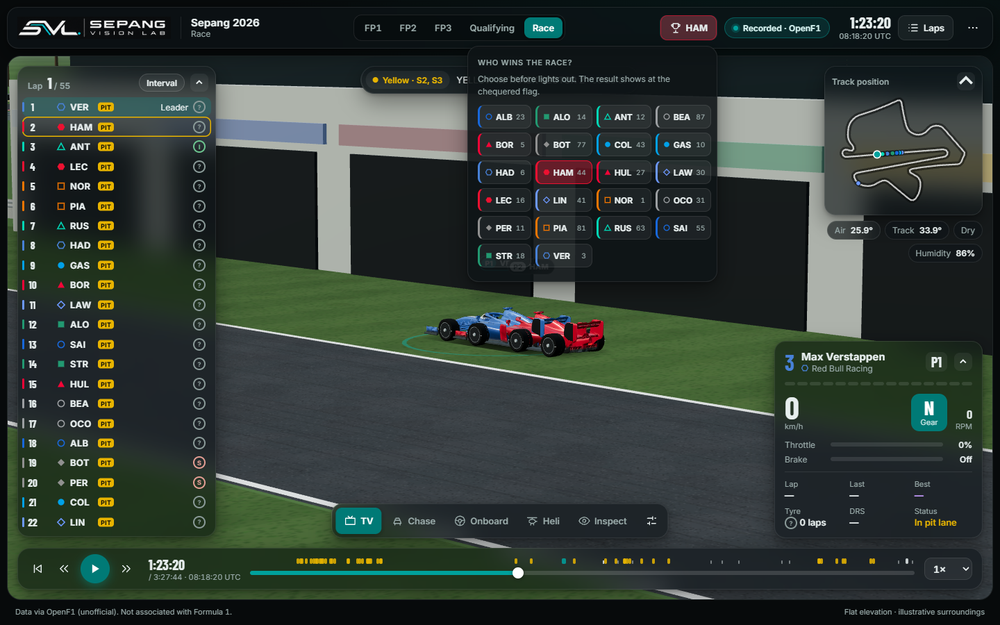
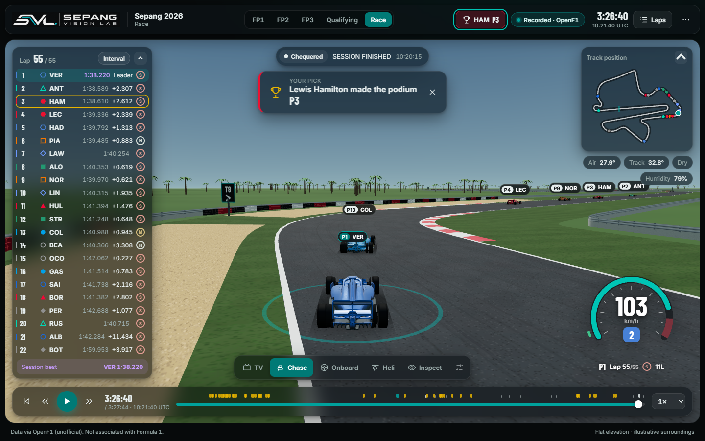

# Sepang Vision Lab

A 3D, broadcast-style replay of the 2026 Sepang weekend (OpenF1 meeting 1308, 2 to 4 October 2026): FP1, FP2, FP3, Qualifying and the Race, built from public OpenF1 data. Real driver names, team colours, positions, telemetry, tyres, race control and weather, with cars driving an aligned 3D model of the circuit.

Live: https://sepangvisionlab.madebyrazeen.com/


## Features

- **Five 3D cameras:** TV (trackside, picks a clear line of sight), Chase, Onboard, Heli and Inspect. Chase and Onboard add a speed-sensitive lens, acceleration lag and a light high-speed shake.
- **Driving HUD** in Chase and Onboard: a rev arc with shift flash, speed, gear, throttle and brake, position, lap, tyre and DRS, all from recorded channels.
- **Pick your winner** (Race only): choose a driver before lights out. Picks lock at the start, your driver is followed live, and the official result is revealed at the chequered flag. Stored in your browser only.
- **Broadcast overlays:** a timing tower that fits all 22 cars (intervals or gap to leader, best laps, tyres, pit badges), track map, weather, race-control messages with flag status, and a replay bar with incident markers. Scrubbing keeps the replay playing if it was playing.
- **Laps panel:** lap and sector times for the selected driver, plus session details.
- **Realistic 3D:**
  - **Cars:** clear-coat paint lit by the sky, steering and spinning 18-inch style wheels with speed blur, sprung body pitch and roll, downforce squat, and a rain light in the wet and in the pit lane.
  - **Track:** textured asphalt with rubber marks, raised kerbs, gravel traps, tyre walls, guardrails and catch fencing.
  - **Start area:** a chequered start line and painted grid boxes.
  - **Pit lane:** a separate lane with a pit wall.
  - **Surroundings:** grandstand crowd, oil palms, trees and distant hills.
- **Quality presets:** Low, Balanced (default) and High; High adds sun shadows for every nearby car.
- **Themes:** SVL (teal) and Broadcast (red), both glass-panel layouts. Present mode (`P`) hides the chrome.
- **Optional hand gestures** through the webcam (MediaPipe, runs locally; see docs/GESTURE_CONTROLS.md).

| | |
|---|---|
|  |  |
|  |  |

## Run

Requires Node.js 22.12+ (tested with Node 24). No backend service is needed.

```sh
npm install
npm run dev
```

Open the localhost URL printed by Vite. Add `?perf` to show a frame-rate meter (development only).

```sh
npm run build
npm test
```

## How the replay works, and how accurate it is

- **Alignment.** OpenF1 positions are fitted to the circuit model with a DERIVED similarity transform: RMS 3.09 m and p95 5.69 m to the centre line. That residual includes the real racing line.
- **Smooth, physical motion.** OpenF1 samples arrive at about 4 Hz with jittery timestamps.
  - Each car's distance along the track and its across-track offset are refitted with a Gaussian-weighted local straight-line fit against time (σ 500 ms and 600 ms).
  - The track itself is a smooth curve.
  - Cars point along their real path, including the racing line, and steer from its curvature.
  - `npm run check:physics` samples every car at 50 Hz across the race: 99% of frames stay within 3.7 g braking or acceleration and 5.9 g cornering, the range of a real car. A data gap holds the last sample and marks the car stale after 2 s.
- **Pit lane.** DERIVED from where cars drove during all 73 race pit stops (`npm run data:pitlane`, written to `src/data/circuits/sepangPitLane.json`). Its width, wall and apron are illustrative.
- **Tyres.** OpenF1's race stints change compound on lap 2 or 3 with no pit stop, so tyre sets are rebuilt from pit-out laps. A set whose OpenF1 labels disagree shows `?` instead of a guess. Practice and qualifying are unchanged by this.
- **Verified.** All five sessions were compared with the live OpenF1 API (laps, stints, pits, race control, classification). The position and telemetry streams have no gap over 60 s.
- **Meeting name.** OpenF1 lists meeting 1308 as the "Bahrain Grand Prix" with location Kuala Lumpur. The app never shows that name.

## Data pipeline

The replay files in `public/sessions/1308/` are committed. To rebuild them (Python 3.12, standard library only):

```sh
npm run data:fetch      # OpenF1 meeting 1308 into data/raw/openf1/ (gitignored, resumable, throttled)
npm run data:build      # compact replay files into public/sessions/1308/
npm run data:align      # fit OpenF1 positions to the track (public/sessions/1308/alignment.json)
npm run data:pitlane    # derive the pit lane from the race pit stops
npm run test:pipeline
```

The fetcher caches every 30-minute window and reuses a cached window only if it was fetched for exactly the same URL.

## Project layout

```text
src/
  App.tsx, main.tsx, styles.css     app shell and the glass design system
  components/
    recorded/                       workspace, replay bar, telemetry card, HUD, pick your winner
    circuit/                        3D scene, cameras, quality presets
      environment/                  track surfaces, pit lane, scenery, sky
    cars/                           car model, livery, generated wheels
    standings/, broadcast/          timing tower, track map, team glyphs, theme toggle
    handtracking/, ui/              MediaPipe gestures, icons and popovers
  domain/                           pure logic: replay, recorded session, motion, pit lane, picks
  data/circuits/                    circuit GeoJSON, spatial references, derived pit lane
  services/recordedLoader.ts        loads a session and prepares each driver
public/sessions/1308/               committed OpenF1 replay files
scripts/                            OpenF1 fetch, build, alignment, pit-lane derivation, physics check
tests/                              node --test suites (npm test)
backend/                            optional gesture-model trainer (npm run train:gestures)
docs/                               milestone notes, circuit data, gestures, screenshots
```

## Provenance and licences

- **Circuit geometry:** Tomislav Bacinger, f1-circuits (MIT), unchanged in `src/data/circuits/sepang.json`. A test checks its bytes. Provenance and limitations are in docs/CIRCUIT_DATA.md. The track is rescaled to the official 5.543 km and has flat elevation.
- **Spatial references** (pit building, main grandstand, timing anchors): `src/data/circuits/sepangSpatialReferences.ts`, with accuracy classes and sources; see docs/VISUAL_V2_5A_SPATIAL_REFERENCE.md.
- **Scenery** (kerbs, barriers, fences, buildings, crowd, trees, hills, sky) is generated in code and illustrative. The car is a stylized SVL model, not a replica of any race car.
- **Hand tracking:** MediaPipe Hands, vendored in `public/vendor/mediapipe` (licence and provenance there). It runs locally and no frames leave the browser.
- **Fonts:** Barlow Condensed and Inter, bundled through @fontsource and served locally, SIL Open Font License 1.1.
- **Header artwork:** the owner's SVL logo.

Data via OpenF1 (unofficial, https://openf1.org). Not associated with Formula 1. Driver and team names are shown for identification only. No team, series or sponsor logos are used, and OpenF1 `headshot_url` images are never downloaded or used. This is an independent project with no official affiliation with or endorsement by Formula 1, any team, the circuit or OpenF1. Trademark rights remain with their owners.

## Deploying (Vercel, static)

Pushing to `main` deploys production. `vercel.json` runs `npm run build`, then `scripts/prune-dist.mjs` drops an unused 28 MB authoring model from the output, and caches the session files. Everything runs in the browser.

## History

Milestone notes for the current app are in `docs/MILESTONE_18.md` to `docs/MILESTONE_23.md`:

| Milestone | What it covers |
|---|---|
| M18 | 3D driver view |
| M19 | Recorded 2026 Sepang |
| M20 | 2026 only, the glass UI, and 3D only |
| M21 | Realism |
| M22 | HUD, pick your winner, wheels and track detail |
| M23 | Physical motion, pit lane, and the race data fix |

Earlier work (a synthetic physics session, the 2017 Malaysian Grand Prix replay, strategy and Monte Carlo tools, a race engineer and a flat map view) was removed to focus on the 2026 replay and remains in the git history. `docs/PRD.md` is the original product brief.
